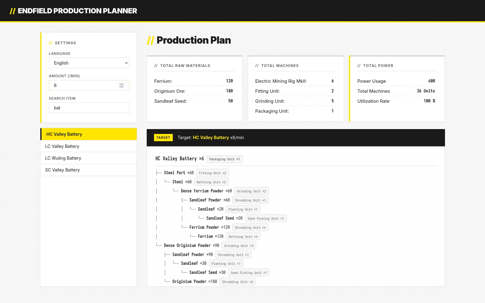

# Endfield Production Planner

**[Live Demo](https://your-username.github.io/resource-calculator-endfield/)**

A production calculator for **Arknights: Endfield**.
Calculate the resources, machines, and power needed to produce any item.

**アークナイツ：エンドフィールド** の生産計算機です。
任意のアイテムの生産に必要な素材・機械・電力を計算できます。

---

## Features / 機能

- 🌳 Production dependency tree / 生産依存ツリー表示
- ⚡ Power & machine summary / 電力・機械数の集計
- 🌐 English / 日本語 support

## Contributing / 貢献

Contributions are welcome! Feel free to open issues or pull requests.

貢献を歓迎します！Issue や Pull Request はお気軽にどうぞ

## License / ライセンス

MIT
